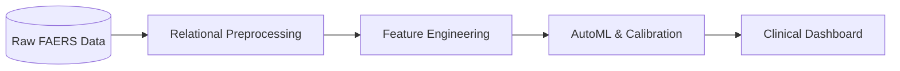
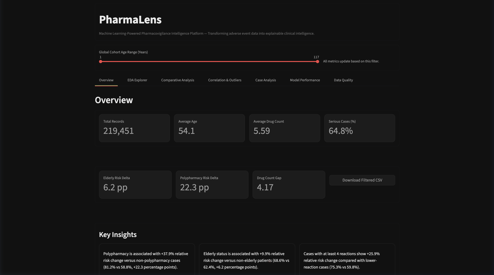
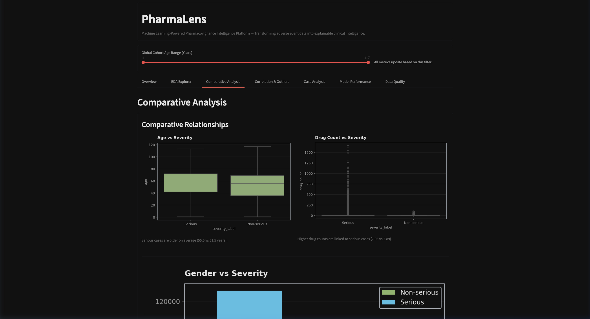
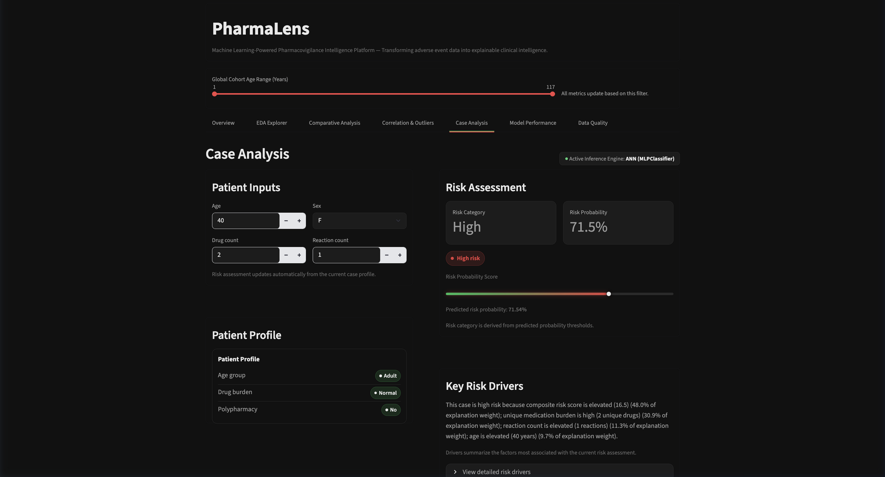
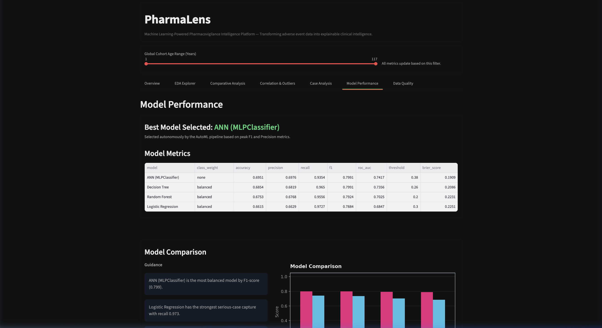
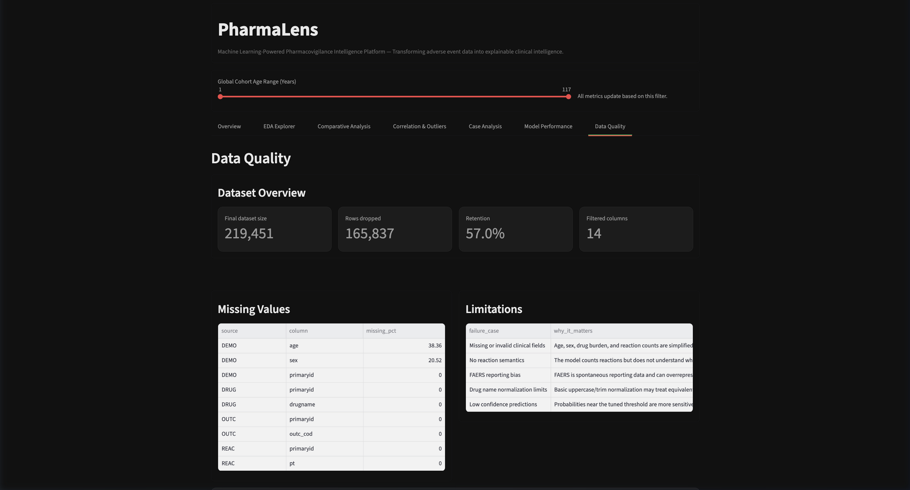

# PharmaLens

Transforming adverse event data into explainable clinical intelligence.

Machine Learning-powered Pharmacovigilance Intelligence Platform

Machine learning platform for analyzing FDA FAERS adverse event reports and supporting clinical risk assessment through interactive analytics and explainable predictions.

<p align="center">
  
  
  
  
  
  
  
</p>

---

## Overview

Traditional analysis of FDA FAERS data requires manual processing of multiple relational datasets before meaningful clinical insights can be extracted. PharmaLens automates this workflow by combining data engineering, machine learning, and interactive visualization into a single application that supports faster adverse event analysis and clinical risk assessment.

The system aggregates demographics, drug exposure, symptom logs, and patient outcomes on standard local hardware. By applying machine learning models, it classifies whether an exposure profile is likely to result in serious clinical outcomes (e.g., hospitalization or death).

---

## Highlights

* Processes FDA FAERS adverse event datasets
* Multi-table preprocessing pipeline
* Four-model machine learning evaluation
* Validation-based threshold optimization
* Interactive Streamlit dashboard
* Clinical risk prediction and scenario simulation

---

## Problem Statement

Spontaneous reporting databases like FDA FAERS contain millions of records across independent demographic, drug, reaction, and outcome flat files. Analyzing post-market signals requires heavy data scrubbing, relational merging, and target-leakage management. Furthermore, clinical triage is hindered by class imbalance (where severe events represent a high portion of reports) and standard machine learning default thresholds yield poor clinical recall, failing to capture high-risk cases.

---

## Solution

PharmaLens addresses these challenges by implementing:
* **Relational Merges**: Automated ingestion joins DEMO, DRUG, REAC, and OUTC flat files cleanly on unique patient identifiers.
* **Leakage-Safe Scaling**: Standardizers and splits are computed strictly on training data to prevent optimistic performance inflation.
* **Recall-Optimized AutoML**: An offline evaluation loop benchmarked against validation splits sweeps classification thresholds to maximize class F1-scores and capture high-risk reports.
* **Interactive Triage workspace**: A Streamlit interface designed for safety officers to filter cohorts, simulation profiles in real time, and process batch datasets.

---

## Architecture



1. **Data Preprocessing**: Filters demographic age outliers and joins relational source flat files on patient identifiers.
2. **Feature Engineering**: Derives medication history metrics, duplicate exposure flags, and a composite risk score.
3. **Automated ML Pipeline**: Implements stratified train/validation/test splits, performs standard scaling normalization, trains candidate models, and executes validation set threshold tuning.

---

## Key Features

### Data Engineering
* **Relational Pipeline**: Merges raw demographic tables with exposures and outcome logs.
* **Leakage Prevention**: Standardizes scaling parameters strictly on training splits.

### Machine Learning
* **Candidate benchmarks**: Automated training sweeps across ANN, Random Forest, Decision Tree, and Logistic Regression models.
* **Threshold sweep**: Optimizes model validation scores to calibrate recall ratios.

### Clinical Decision Support
* **Triage Stratification**: Maps predictive probabilities into Low, Medium, and High clinical risk categories.
* **Explainable weights**: Local feature importance approximations computed using test split permutations.

### Analytics
* **Dimensionality Reduction**: Projects high-dimensional patient data onto 2D PCA spaces.
* **Cohort Clustering**: Unsupervised KMeans clustering groupings for demographic triage.

### Developer Experience
* **Modular Structure**: Project refactored into logical packages.
* **Continuous Integration**: GitHub Actions workflow running automated checks and pytest unit tests.

---

## Results

To resolve majority-class dominance in spontaneous reporting datasets, classification decision thresholds were optimized on the validation split to maximize class F1-Scores. The hold-out test set evaluation results are:

| Model Candidate | Accuracy | Precision | Recall | F1-Score | ROC-AUC | Optimal Threshold |
| :--- | :---: | :---: | :---: | :---: | :---: | :---: |
| **ANN (MLPClassifier)** | **69.51%** | **69.76%** | **93.54%** | **0.7991** | **0.7417** | **0.38** |
| **Decision Tree** | 68.54% | 68.19% | 96.50% | 0.7991 | 0.7356 | 0.26 |
| **Random Forest** | 67.53% | 67.68% | 95.56% | 0.7924 | 0.7025 | 0.20 |
| **Logistic Regression** | 66.15% | 66.29% | 97.27% | 0.7884 | 0.6847 | 0.30 |

*The ANN (MLPClassifier) is selected as the champion model due to optimal precision-recall balance.*

---

## Screenshots

<table align="center" width="100%">
  <tr>
    <td align="center" width="50%">
      <br/>
      <strong>Overview Dashboard</strong>: Cohort demographics and active filters.
    </td>
    <td align="center" width="50%">
      <br/>
      <strong>Clinical Analytics</strong>: Medication spreads and age distributions.
    </td>
  </tr>
  <tr>
    <td align="center" width="50%">
      <br/>
      <strong>Risk Prediction</strong>: Live patient simulation and triage dial.
    </td>
    <td align="center" width="50%">
      <br/>
      <strong>Model Performance</strong>: AutoML benchmarks and evaluation curves.
    </td>
  </tr>
  <tr>
    <td align="center" colspan="2">
      <br/>
      <strong>Data Quality</strong>: Source row drops, ingestion stats, and validation audits.
    </td>
  </tr>
</table>

---

## Repository Structure

```text
PharmaLens/
├── .github/
│   └── workflows/
│       └── ci.yml               # CI test pipeline
├── core/
│   ├── config.py                # Parameters and palettes
│   ├── pipeline_logging.py      # Logger configuration
│   └── utils.py                 # UI and math helper metrics
├── data/
│   ├── data_processing.py       # Joins and preprocessing
│   └── sample_reports.csv       # Sample cases CSV for batch uploader testing
├── docs/
│   ├── ARCHITECTURE.md          # pipeline engineering details
│   └── SETUP.md                 # Isolated env setup instructions
├── frontend/
│   ├── ui_components.py         # Streamlit visual components
│   └── visualizations.py        # Figure treating helpers
├── ml_engine/
│   ├── decision_support.py      # KPI summaries calculations
│   ├── ml_pipeline.py           # AutoML training sweeps
│   └── risk_logic.py            # Normalization rules and checks
├── screenshots/
│   └── *.png                    # Dashboard interface captures
└── tests/
    └── test_pipeline.py         # Pipeline unit tests
```

---

## Installation

1. **Clone the Repository**:
   ```bash
   git clone https://github.com/yourusername/PharmaLens.git
   cd PharmaLens
   ```
2. **Setup Environment**:
   Create and activate an isolated python environment:
   ```bash
   python3 -m venv .venv
   source .venv/bin/activate
   pip install -r requirements.txt
   ```
3. **Download FAERS Dataset**:
   Download and paste 2025 Q4 flat files into the project root directory. For data details and download instructions, see [docs/SETUP.md](docs/SETUP.md).
4. **Environment Settings**:
   Create local environment file:
   ```bash
   cp .env.example .env
   ```
5. **Run Streamlit**:
   ```bash
   streamlit run app.py
   ```

*For more details on configuration, see [docs/SETUP.md](docs/SETUP.md).*

---

## Future Improvements

* **SHAP Explainability**: Render local SHAP explainability plots inside the simulator.
* **Drug Interaction Modeling**: Train models to predict risk scores for multi-drug combinations.
* **FHIR Interoperability**: Conform outputs to standard healthcare electronic records exchange formats.
* **Inference API**: Port prediction endpoints to a fastAPI microservice.

---

## License

Licensed under the [MIT License](LICENSE).
