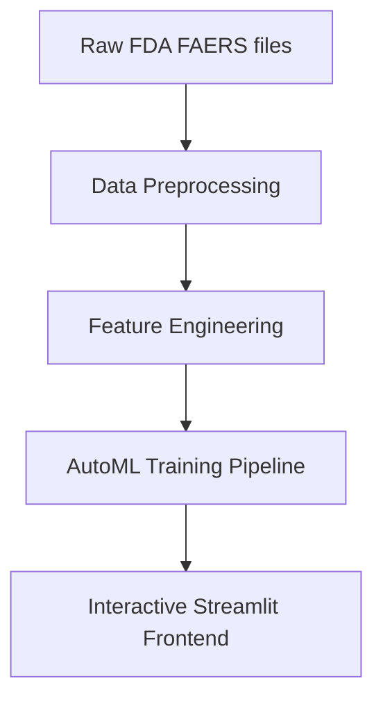

# 🏛️ PharmaLens System Architecture

This document describes the data flow, feature engineering, and machine learning components of PharmaLens, a Machine Learning-Powered Pharmacovigilance Intelligence Platform designed to transform adverse event data into explainable clinical intelligence.

---

## 🏗️ Architectural Overview

The application is structured as a single-process Streamlit dashboard that runs locally. The system consumes raw FDA FAERS ASCII flat files and outputs cohort analytics and case-level predictions. 

---

## 1. Data Processing Pipeline

The dataset is ingested through `data_processing.py`, which performs cleaning, merging, and validation across four relational text files using `primaryid` as the primary key:

1. **DEMO (Demographics)**: Source of patient age and sex. Contains patient demographics. Records with missing identifiers, ages below 1 or above 120, or unclassified sex are filtered out.
2. **DRUG (Drug Exposure)**: Maps drugs to reports. Used to calculate total medication count per patient.
3. **OUTC (Outcomes)**: Records serious patient outcomes (hospitalization, death, disability, etc.). Used to derive the binary classification target `serious`.
4. **REAC (Reactions)**: Logs reported symptoms/adverse events. Used to compute reaction counts.

### Join & Clean Flow
* Load DEMO, DRUG, OUTC, and REAC files.
* Filter age bounds (0 < Age < 120) and clean gender values.
* Group drug counts by `primaryid` to count total reports.
* Group outcome logs to flag patient reports associated with severe outcomes (`serious = 1`).
* Group reaction events to calculate `reaction_count`.
* Perform left joins starting with the cleaned DEMO cohort to prevent target leakage.

---

## 2. Feature Engineering

The system constructs 9 primary ML features to capture clinical complexity:
* **age** (Continuous): Patient age in years.
* **sex_code** (Binary): Encoded patient sex (`0` for Female, `1` for Male).
* **drug_count** (Integer): Total medications reported in the case.
* **unique_drug_count** (Integer): Unique normalized drug names, identifying instances where duplicates are recorded.
* **drug_repeat_flag** (Binary): Set to `1` if duplicate entries exist for a single drug in a report, indicating potential clinical reporting noise.
* **reaction_count** (Integer): Total distinct symptoms recorded.
* **polypharmacy** (Binary): Flagged if the patient is exposed to 5 or more active drugs.
* **elderly** (Binary): Flagged if the patient is 65 years or older.
* **risk_score** (Continuous): A composite score combining age, drug count, unique drug counts, and reaction counts to quantify prior report severity.

---

## 3. AutoML Training and Evaluation

The machine learning engine in `ml_pipeline.py` executes the following steps during training:

### A. Train-Validation-Test Split
* Active data is split into **Training (70%)**, **Validation (15%)**, and **Testing (15%)** sets.
* Splits are stratified by the target `serious` column to maintain severe outcome ratios across splits.

### B. Scaler Normalization
* A `StandardScaler` fits on training data and transforms validation and test splits to prevent data leakage.

### C. Hyperparameter & Model Sweep
The pipeline trains and evaluates four primary classifier families:
* **Artificial Neural Network (MLPClassifier)**: 3-layer architecture `(96, 48, 24)` with early stopping.
* **Random Forest Classifier**: Multi-tree ensemble configured for balanced class weights.
* **Logistic Regression**: Baseline linear classifier.
* **Decision Tree Classifier**: Interpretable rule-based estimator.

### D. F1 Threshold Tuning
To optimize model performance, the pipeline tunes the classification threshold on the **Validation Set**:
* Evaluates thresholds between `0.20` and `0.80` in steps of `0.02`.
* Selects the threshold maximizing the **F1-Score** for each model class.

### E. Model Diagnostics
The system computes:
* **Mutual Information**: Evaluates feature relevance against the target.
* **PCA (Principal Component Analysis)**: Projects high-dimensional feature spaces onto 2D projections.
* **Unsupervised Clustering (K-Means)**: Groups cohort features into three distinct clusters.
* **Permutation Importance**: Estimates feature contribution by evaluating model performance degradation when shuffling individual feature columns.
